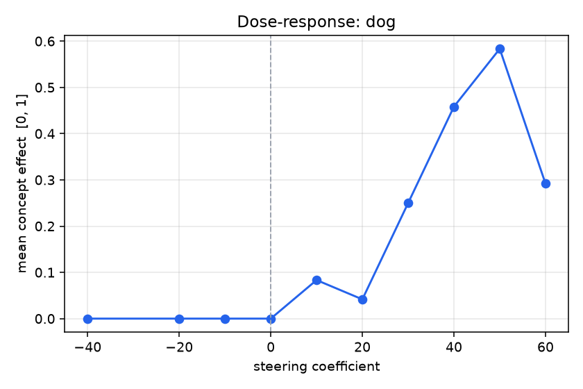
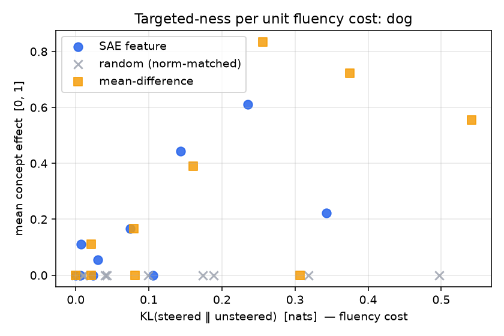
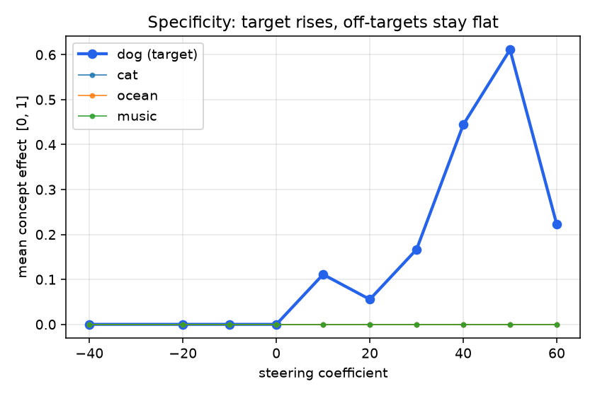

# Scalpel

**Causally steer an LLM's behavior by intervening on a single Sparse Autoencoder
(SAE) feature — and prove it with numbers, not screenshots.**

Scalpel finds an interpretable feature inside an open language model using a
released SAE suite, then adds that feature's decoder direction to the residual
stream during generation. The point of the project is not that steering *looks*
like it works — it is the **measured, controlled evidence** that a single feature
direction causally controls a specific, human-interpretable behavior:

- a **dose-response curve** (effect vs. steering coefficient, including negative
  coefficients for suppression),
- a **fluency check** (perplexity / KL divergence vs. the unsteered model, to
  prove we are not lobotomizing it),
- a **specificity check** (the target concept rises while unrelated behaviors stay
  flat), and
- **baseline controls** — the SAE feature is compared against a random direction
  of equal norm and a mean-difference steering vector. *Without the
  random-direction control the result is not credible, so it is never skipped.*

> Status: **Milestones 1–5 complete** — scaffold, config, SAE loading, an offline
> reconstruction sanity check, contrastive **feature discovery** with Neuronpedia
> labels, the causal **steering hook**, the quantitative **measurement**
> (dose-response + fluency), and the **baseline controls + specificity**. Still to
> come: the reproducible demo notebook (M6). See the [roadmap](#roadmap).

## Headline result

gpt2-small · SAE `gpt2-small-res-jb` layer 7 · feature **8243** (*"references to
dogs"*) · concept **dog** · 6 prompts, keyword effect scorer. Every number below
comes from one `scalpel eval` run.



| coef | effect `[0,1]` | perplexity | KL(steered‖base) |
|-----:|:--------------:|:----------:|:----------------:|
| −40  | 0.000 | 5.64 | 0.106 |
|   0  | 0.000 | 4.45 | 0.000 |
|  20  | 0.056 | 3.44 | 0.030 |
|  30  | 0.167 | 3.26 | 0.075 |
|  40  | 0.444 | 4.78 | 0.144 |
| **50** | **0.611** | **5.07** | **0.235** |
|  60  | 0.222 | 8.47 | 0.343 |

Adding the SAE feature direction causally raises the dog concept with a clear
**dose-response**, peaking at coef 50; push past it (coef 60) and perplexity
jumps (5.1 → 8.5) as coherence breaks — the fluency-limited sweet spot. KL rises
monotonically with `|coef|`. Negative coefficients don't create dogs (the concept
is already absent from neutral prompts), as expected for an additive intervention.

### Baseline controls (the part that makes it credible)

The single most important control: a **random direction of equal norm**. If a
random perturbation of the same magnitude steered the concept just as well, the
SAE feature would mean nothing. It doesn't:



- **Random (norm-matched): effect 0.000 at every coefficient**, all the way out to
  KL ≈ 0.5. Randomly pushing the residual by the same amount *never* produces dogs.
  The SAE feature's effect is therefore causal and direction-specific, not an
  artifact of perturbation magnitude. ✅
- **Mean-difference** (`mean(resid | dog) − mean(resid | ¬dog)`, norm-matched): a
  strong baseline that is **competitive with — and at its peak exceeds — the SAE
  feature** (0.83 vs 0.61 effect, at similar KL). We report this straight rather
  than hide it: diff-in-means is a genuinely strong steering direction, consistent
  with recent findings ([AxBench](https://arxiv.org/abs/2501.17148)). The SAE
  feature is validated as a *real, specific, interpretable* direction — not as the
  uniquely best steering vector.

### Specificity

Steering the dog feature moves **only** dogs. Three off-target probes
(cat, ocean, music) stay pinned at 0 while the target climbs to 0.61:



---

## Why these choices

| Decision | Choice | Rationale |
| --- | --- | --- |
| Core language | **Python** | The SAE ecosystem (SAELens, TransformerLens, nnsight, the released weights) is Python-only. |
| Hooking library | **TransformerLens** (`HookedSAETransformer`) | Clean residual-stream HookPoints; supports gpt2-small and gemma-2-2b; runs on CPU/MPS/CUDA. |
| SAE loading | **SAELens** | Loads Gemma Scope and GPT-2 SAEs; decoder columns are the feature directions. |
| Default showcase | **Gemma Scope · `gemma-2-2b`** | Smoothest integration (Neuronpedia feature labels, JumpReLU 16k SAEs); runs on one consumer GPU or Apple MPS. |
| CPU / CI path | **gpt2-small + `gpt2-small-res-jb`** | Runs anywhere with no GPU, so reviewers and CI can run something end to end. |
| Optional heavy backend | **Qwen-Scope · `Qwen3-8B`** via nnsight | Newer, larger; configurable for users with GPU headroom. |
| LLM-judge | **Ollama** (`qwen2.5:7b`) | Scoring concept presence is text-in/text-out — a perfect local, free judge. A deterministic keyword scorer is the CI fallback. |

Nothing about the model, SAE, layer, or feature is hardcoded — everything is
driven by a YAML config (see [`configs/`](configs/)).

### A note on Ollama

Ollama **cannot be the steered model**: steering injects a vector into the
residual stream *during the forward pass*, which requires PyTorch forward hooks.
Ollama serves GGUF text-in/text-out over REST with no access to intermediate
activations. Scalpel therefore uses Ollama only as the **LLM-judge** for the
effect metric, and steers a Hugging Face / TransformerLens model instead.

---

## Install

Scalpel targets **Python 3.11–3.12** (PyTorch / TransformerLens wheels lag newer
interpreters). Using [`uv`](https://github.com/astral-sh/uv):

```bash
uv venv --python 3.12 .venv
source .venv/bin/activate

# Core + dev tools (enough for the mock path, the unit tests, and CI):
uv pip install -e ".[dev]"

# Add the heavy model stack when you want to run a real model:
uv pip install -e ".[models,judge,viz]"
```

Copy the environment template and adjust as needed:

```bash
cp .env.example .env
```

---

## Quick start

Run the **download-free smoke check** (mock backend — no model, no network). It
exercises the full path: capture activations → SAE encode/decode → report
reconstruction quality.

```bash
scalpel smoke --backend mock
```

Run the **real CPU smoke check** on gpt2-small + a released SAE (downloads the
model and SAE on first run, then caches them; needs the `models` extra):

```bash
scalpel smoke --config configs/gpt2-small.yaml
```

Real output on gpt2-small (`gpt2-small-res-jb`, layer 7) — the SAE recovers
~99.9% of the residual-stream variance with ~47 active latents per token, which
is exactly the healthy range for these SAEs:

```
scalpel smoke
  backend           : transformerlens
  model             : gpt2
  device            : cpu
  hook              : blocks.7.hook_resid_pre
  d_model / d_sae   : 768 / 24576
  tokens            : 48
  reconstruction MSE: 0.654657
  variance explained: 0.9991
  mean L0 (sparsity): 47.00
```

(The MSE is large only because the residual stream itself has a large norm —
variance-explained is the meaningful reconstruction metric.)

Run **feature discovery** for a concept. Scalpel splits the corpus into
concept-positive / negative snippets, encodes each to SAE features, and ranks
features by a contrastive score (`mean(pos) − mean(neg)`):

```bash
scalpel discover --concept dog --terms dog puppy \
  --config configs/gpt2-small.yaml --top-k 8 --labels
```

Real output on gpt2-small — the top feature is sharply concept-specific, and the
`--labels` flag confirms it against Neuronpedia:

```
scalpel discover  concept='dog'  terms=['dog', 'puppy']
  hook              : blocks.7.hook_resid_pre
  neuronpedia       : gpt2-small/7-res-jb
  positive/negative : 4/42 snippets
  top 8 features (contrastive score = pos_mean - neg_mean):
    #1  feature 8243   score=+45.910  pos=46.074 neg=0.164  — references to dogs
         e.g. "The dog ran across the yard chasing after the red rubber ball."
    ...
```

Feature **8243** fires at ~46 on dog snippets and ~0.16 everywhere else — the
Neuronpedia label is literally *"references to dogs"*. That is the feature we
steer on next.

**Steer** generation on that feature. Scalpel adds `coef · W_dec[8243]` to the
residual at layer 7 during greedy decoding, so the *only* difference between the
two completions is the steering vector:

```bash
scalpel steer --feature 8243 --coef 40 \
  --prompt "My favorite thing to do on the weekend is" \
  --config configs/gpt2-small.yaml
```

Real output on gpt2-small:

```
--- unsteered ---
My favorite thing to do on the weekend is to go to the beach and watch the
sunset. I love the view of the ocean and the beautiful views of the ocean. ...

--- steered ---
My favorite thing to do on the weekend is to play with my dog. I love it, but
I can't really say it's my favorite. ...
```

The dog concept is injected causally while the text stays fluent — the
qualitative version of the dose-response and fluency results below.

**Measure** the whole dose-response: sweep the coefficient, score concept
**effect** (keyword scorer, or `--judge` for the Ollama LLM-judge), and track
**fluency** (perplexity + KL). Writes a CSV/JSON table and the plots:

```bash
scalpel eval --feature 8243 --concept dog --terms dog dogs puppy puppies \
  --coefs -40 -20 -10 0 10 20 30 40 50 60 \
  --prompts "I think that" "The weather today" "Let me tell you about" \
            "My favorite thing is" "Yesterday I went to" "When I woke up this morning" \
  --baselines --probes cat ocean music \
  --config configs/gpt2-small.yaml --out outputs/gpt2_dog
```

`--baselines` adds the **random** and **mean-difference** control sweeps;
`--probes` adds the **specificity** panel. This one command regenerates every
plot and table in the [headline result](#headline-result) above.

---

## CLI

| Command | Status | Purpose |
| --- | --- | --- |
| `scalpel smoke` | ✅ M1 | Load a model + SAE and report reconstruction error. |
| `scalpel discover --concept X` | ✅ M2 | Find the SAE feature(s) most associated with a concept. |
| `scalpel steer --feature N --coef C --prompt "..."` | ✅ M3 | Steer generation with a feature direction. |
| `scalpel eval` | ✅ M4–5 | Coefficient sweep → dose-response, fluency, baseline controls, specificity. |

---

## How steering works (the mechanics)

The decoder columns of the SAE are directions in residual-stream space. Row `i`
of `W_dec` is the unit that latent `i` writes to — and it is exactly the vector
Scalpel adds to steer the model:

```
steering_vector = SAE.W_dec[feature_index]          # shape [d_model]
residual[layer] += coef * steering_vector           # added during generation
```

Sweeping `coef` (including negative values for suppression) produces the
dose-response curve. The **baseline controls** replace `steering_vector` with:

- a **random Gaussian direction** L2-normalised to the same norm, and
- a **mean-difference** vector: `mean(resid | concept-positive) − mean(resid | concept-negative)`.

The SAE feature should deliver more targeted effect **per unit of fluency cost**
than either baseline.

---

## Development

```bash
pytest             # unit suite (CPU-only, no downloads)
ruff check .       # lint
black --check .    # format
mypy               # types
```

The unit tests are fully offline: the mock backend and hand-built tiny SAEs
cover the SAE math, steering-vector construction, metric math, config, and CLI
wiring without touching a real model. CI runs this suite on
`{ubuntu, macos} × {py3.11, py3.12}`; a separate, gated job runs the real
gpt2-small reconstruction smoke.

---

## Roadmap

1. **✅ Scaffold + reconstruction sanity** — package, config, SAE loading, `scalpel smoke`.
2. **✅ Feature discovery** — contrastive scoring + max-activating examples over a corpus; Neuronpedia labels.
3. **✅ Steering hook** — inject the feature direction during generation; qualitative before/after.
4. **✅ Measurement** — effect (keyword + Ollama judge) + fluency (perplexity/KL); coefficient sweep → dose-response plot.
5. **✅ Controls** — random-direction and mean-difference baselines; specificity panel.
6. **Package** — CLI polish, reproducible demo notebook, README with plots + results table.

---

## Reproducibility

Fixed seeds across Python / NumPy / PyTorch; content-addressed activation
caching; greedy or seeded sampling. Some GPU/MPS kernels are not bit-for-bit
deterministic even with a fixed seed — this residual nondeterminism is expected
and documented rather than hidden.

**Apple Silicon / MPS caveat.** On some PyTorch builds TransformerLens warns that
the MPS backend "may be silently incorrect". The portable `gpt2-small` config is
therefore pinned to CPU. The `gemma-2-2b` config uses `device: auto` (→ MPS on an
M-series Mac) for speed; Scalpel acknowledges the opt-in, but for numbers you
intend to report, cross-check a subset on CPU or CUDA.

## License

[MIT](LICENSE) © 2026 Dylan Patriarchi
